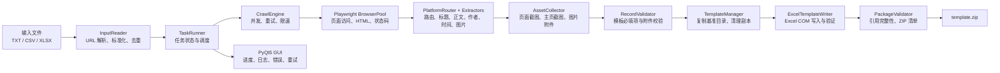

# 舆情验证报告工具技术方案

## 1. 文档信息

- 项目名称：舆情验证报告工具（Public Opinion Verification Report Tool）
- 文档版本：v0.3
- 编写日期：2026-07-28
- 需求依据：[requirements.md](requirements.md)
- 适用范围：Windows 本地桌面应用 MVP

## 2. 设计目标与关键决策

### 2.1 目标

系统接收批量网页 URL，使用浏览器完成动态页面访问、内容抽取、截图和图片附件下载，再依照固定的 `template/` 交付契约生成 `template.zip`。

实现必须优先保证三件事：

1. 源 `template/` 目录绝不被修改。
2. 生成的 `template.xlsx` 保留原有工作表、列、数据验证、格式和保护。
3. 每一个 Excel 中出现的截图/附件文件名都对应 ZIP 内的真实文件。

### 2.2 技术决策

| 决策 | 方案 | 原因 |
| --- | --- | --- |
| 页面访问和截图 | Playwright Chromium | 目标站点普遍依赖 JavaScript；同一浏览器上下文可同时用于提取页面和截图。 |
| 抓取并发 | `asyncio` + 固定数量 worker + 域名限速 | 既能批量处理，也能控制对单一平台的访问频率。 |
| 结构化提取 | 平台规则优先，JSON-LD/meta/通用 DOM 兜底 | 模板字段有平台特定的账号、店铺、公众号要求。 |
| 固定模板写入 | Windows Microsoft Excel COM 自动化（`pywin32`） | 基准文件为受保护的 OLE Office 工作簿，普通 `.xlsx` 库无法可靠保留其验证规则和格式。 |
| 用户输入 Excel | `openpyxl` | 只读取用户提供的标准 `.xlsx`，不用于写出固定模板。 |
| 打包 | Python `zipfile`，显式写入归档名 | 可精确控制 ZIP 必须具有 `template/` 顶层目录，避免平台相关的压缩路径差异。 |
| GUI 后台执行 | `QThread` 内运行独立 asyncio 事件循环，通过 Qt signal 回传 | 避免阻塞 PyQt5 主线程，且不引入额外的事件循环桥接依赖。 |

`pyproject.toml` 和 `requirements.txt` 实施时应新增 Windows 条件依赖：`pywin32>=308; platform_system == 'Windows'`。现有 `openpyxl` 保留给输入文件读取，导出模板时禁止调用它。

### 2.3 参考项目评估与最终选择

`references/MediaCrawler-main` 提供了最成熟的异步生命周期、浏览器资源清理、平台实现边界和登录态管理思路；这些内容适合用于本项目的任务调度与适配器设计。它的代理池、反检测脚本、滑块/验证码处理、请求签名、搜索模式和多数据库存储并不解决固定模板交付问题，而且超出本项目的合规范围，因此不纳入设计。

`references/MediaCrawler-new-main` 的优势是骨架更小、平台目录更直接。其配置以模块级可变全局变量为中心，且平台模型会直接渗透到存储层，不利于本项目把“运行态采集结果”与“固定 Excel 行”隔离。采用其渐进式平台扩展的思路，但不采用其配置与数据流方式。

`references/浏览器插件` 正确体现了模板工作表、示例行、下拉值和截图文件关联的重要性。然而它在导出时使用 SheetJS 新建一个仅含当前工作表的工作簿，会丢失其他表、验证、保护和原格式，不能处理当前 `template.xlsx`。因此只采纳“先验证字段和附件，再交付”的原则，不采纳其导出实现。

最终选择是：采用比 MediaCrawler 主项目更小的“任务编排器 + 平台适配器 + 固定模板导出器”架构；默认使用 Playwright 启动的隔离上下文，用户仅能显式提供 Cookie/storage state 或开启可视化登录。MVP 不使用 CDP 连接用户正在运行的浏览器，也不实现代理池、反检测、验证码处理或访问控制绕过。

参考项目仅作为设计资料，不复制其源代码、许可证文本或平台规避机制。

## 3. 系统架构



运行态数据与交付物分离：标题、作者主页 URL、HTTP 状态码、重定向链和错误信息完整保存在内存结果、任务日志及 GUI 结果表中；只有模板允许的字段和实际存在的附件进入 `template.zip`。

## 4. 任务生命周期与状态机

### 4.1 任务目录

一次任务使用独立的任务 ID，例如 `20260727_143000_ab12cd`。目录约定如下：

```text
output/
└── 20260727_143000_ab12cd/
    ├── runtime/
    │   ├── task.log
    │   └── results.jsonl
    ├── staging/
    │   └── template/
    │       ├── template.xlsx
    │       └── ...本次截图和附件...
    └── template.zip
```

- `runtime/` 仅用于本机诊断与失败重试，不得打入 ZIP。
- `staging/template/` 是基准目录的工作副本；成功打包后可以按配置保留或清理。
- `template.zip` 固定包含 `template/` 顶层目录及其内容。
- 源目录 `template/` 不位于 `output/` 内，所有操作均针对副本。

### 4.2 单条记录状态

```text
PENDING
  -> RUNNING
  -> CRAWLED
  -> ROUTED
  -> ASSETS_READY
  -> READY_FOR_EXPORT
  -> EXPORTED

任意阶段可转入：
  -> NEEDS_REVIEW  （可访问但缺少模板必填字段或平台未匹配）
  -> FAILED        （访问、解析、截图或导出失败）
  -> CANCELLED     （任务被用户取消）
```

- `CRAWLED`：已记录最终 URL、状态码、原始 HTML/DOM 提取结果，但不代表可导出。
- `ROUTED`：已确定模板工作表、标准发布平台和文本类型。
- `ASSETS_READY`：主截图已生成；作者主页截图和页面图片附件可部分失败。
- `READY_FOR_EXPORT`：所选工作表全部必填字段和主截图均满足，且引用附件均存在。
- `NEEDS_REVIEW`：不向 Excel 写入，保留给 GUI 查看或未来人工补录。
- `FAILED`：保存阶段、错误码、可重试标记和用户可读错误信息；不影响其他任务。

## 5. 数据模型

新增 `src/domain/` 包存放稳定的数据模型，避免让 UI、爬虫和导出模块直接交换松散字典。

### 5.1 核心模型

```python
from dataclasses import dataclass, field
from datetime import datetime
from enum import StrEnum
from pathlib import Path


class RecordStatus(StrEnum):
    PENDING = "pending"
    RUNNING = "running"
    CRAWLED = "crawled"
    ROUTED = "routed"
    ASSETS_READY = "assets_ready"
    READY_FOR_EXPORT = "ready_for_export"
    NEEDS_REVIEW = "needs_review"
    FAILED = "failed"
    CANCELLED = "cancelled"
    EXPORTED = "exported"


@dataclass(frozen=True)
class UrlTask:
    evidence_id: int
    original_url: str
    normalized_url: str


@dataclass
class PageData:
    final_url: str | None = None
    title: str | None = None
    content_text: str | None = None
    content_summary: str | None = None
    author_name: str | None = None
    author_id: str | None = None
    author_url: str | None = None
    account_uin: str | None = None
    store_name: str | None = None
    published_at: datetime | None = None
    published_at_raw: str | None = None
    image_urls: list[str] = field(default_factory=list)
    status_code: int | None = None
    redirect_chain: list[str] = field(default_factory=list)


@dataclass(frozen=True)
class RouteDecision:
    sheet_name: str
    platform_value: str
    text_type: str


@dataclass
class AssetSet:
    page_screenshot: Path | None = None
    author_screenshot: Path | None = None
    downloaded_images: list[Path] = field(default_factory=list)


@dataclass
class TaskError:
    stage: str
    code: str
    message: str
    retryable: bool = False


@dataclass
class RecordResult:
    task: UrlTask
    status: RecordStatus = RecordStatus.PENDING
    page: PageData = field(default_factory=PageData)
    route: RouteDecision | None = None
    assets: AssetSet = field(default_factory=AssetSet)
    errors: list[TaskError] = field(default_factory=list)
    started_at: datetime | None = None
    finished_at: datetime | None = None
```

`RecordResult` 是运行态审计事实来源。模板行数据不是独立模型，而是由 `TemplateRowMapper` 从 `RecordResult` 推导，防止模板格式反向限制抓取信息。

### 5.2 模板行模型

```python
@dataclass(frozen=True)
class TemplateRow:
    sheet_name: str
    values_by_column: dict[str, object]
    primary_screenshot_name: str
    attachment_names: list[str]
```

`values_by_column` 的键为 Excel 列字母，例如 `{"A": "https://...", "B": "微信-公众号"}`。日期值使用 Python `datetime`，由 Excel COM 写入为原生日期，不预格式化为字符串。

## 6. 模块与接口设计

### 6.1 建议的代码布局

现有模块基本保持其职责；以下是实现时应新增或调整的文件。

```text
src/
├── domain/
│   ├── models.py                 # UrlTask、RecordResult、TaskError 等
│   └── template_schema.py        # 固定表、列映射、枚举和容量描述
├── services/
│   └── task_runner.py            # 端到端任务编排、取消、进度事件
├── input/
│   ├── reader.py                 # TXT / CSV / 普通 XLSX 输入
│   └── url_parser.py             # URL 提取、规范化、稳定去重
├── crawler/
│   ├── engine.py                 # asyncio worker、重试和域名限速
│   ├── platform_router.py        # 最终 URL -> 工作表/枚举/文本类型
│   ├── content_parser.py         # 通用 DOM、JSON-LD、meta 提取
│   ├── author_extractor.py       # 账号、主页和店铺信息提取
│   └── extractors/
│       ├── base.py               # 平台提取器协议
│       ├── wechat.py
│       ├── bilibili.py
│       ├── weibo.py
│       └── ...                   # 仅为已验证的平台逐步增加
├── screenshot/
│   ├── browser.py                # BrowserPool 与 Context 生命周期
│   ├── page_shooter.py           # 主页面截图
│   ├── author_shooter.py         # 作者主页截图
│   └── asset_collector.py        # 图片筛选与下载
├── export/
│   ├── template_manager.py       # 模板副本、源模板指纹和旧资产清理
│   ├── row_mapper.py             # RecordResult -> TemplateRow
│   ├── excel_writer.py           # Excel COM 读写与工作簿校验
│   ├── package_validator.py      # Excel 附件引用与目录清单校验
│   └── packager.py               # 固定 template.zip 打包
├── ui/
│   ├── main_window.py            # 配置、启动、取消、结果查看
│   └── workers/task_worker.py    # QThread 和 Qt 信号
└── utils/
    ├── file_utils.py             # 安全文件名、哈希、原子替换
    └── time_utils.py             # 时区和发布时间规范化
```

### 6.2 配置

`src/config/settings.py` 使用 `pydantic-settings` 或现有 `AppConfig` 的 dataclass 实现。配置分为不可由用户覆盖的模板配置与可由 GUI 覆盖的任务配置。

| 分类 | 配置项 | 默认值 | 说明 |
| --- | --- | --- | --- |
| 模板 | `template_dir` | `<project>/template` | 只读基准路径，启动时校验存在。 |
| 模板 | `template_filename` | `template.xlsx` | 不允许 GUI 修改。 |
| 模板 | `archive_filename` | `template.zip` | 不允许 GUI 修改。 |
| 抓取 | `max_concurrency` | 3 | worker 数，限制为 1-10。 |
| 抓取 | `page_timeout_seconds` | 30 | `goto` 和关键等待上限。 |
| 抓取 | `max_retries` | 2 | 仅网络超时、429、5xx 等可重试错误。 |
| 抓取 | `min_host_interval_seconds` | 1.0 | 同一域名请求的最小间隔。 |
| 浏览器 | `headless` | `True` | 可由 GUI 覆盖。 |
| 浏览器 | `storage_state_path` | `None` | 用户显式提供的登录态，不写入日志或 ZIP。 |
| 截图 | `screenshot_format` | `jpeg` | 仅 `jpeg` 或 `png`。 |
| 截图 | `full_page` | `True` | 全页截图开关。 |
| 图片 | `download_page_images` | `True` | 是否将页面图片纳入附件。 |
| 图片 | `max_images_per_record` | 20 | 防止单页产生大量附件。 |
| 图片 | `max_image_bytes` | 10 MiB | 单个图片下载上限。 |
| 内容 | `summary_max_chars` | 2,000 | 保证可读且不超过 Excel 单元格上限。 |
| 时间 | `timezone` | `Asia/Shanghai` | 解析相对发布时间时的基准时区。 |

模板工作表名称、列字母、截图列、附件列和平台枚举全部固化在 `template_schema.py`，不得散落在各平台爬虫中。

### 6.3 平台路由与字段映射

`PlatformRouter.route(final_url, page_data)` 返回 `RouteDecision | None`。路由顺序如下：

1. 根据最终域名尝试精确平台规则。
2. 使用平台页面特征确认内容类型，防止短链或跳转页误路由。
3. 返回模板允许的 `sheet_name`、`platform_value`、`text_type`。
4. 没有确定结果时返回 `None`，记录 `ROUTE_UNSUPPORTED`，不写入 Excel。

`TemplateRowMapper.map(result)` 只接受 `READY_FOR_EXPORT` 记录，并按 `template_schema.py` 校验必填字段。例如：

| 路由工作表 | 主截图列 | 附件列 | 特有必填字段 |
| --- | --- | --- | --- |
| 电商平台 | G | H | 商品 URL、平台、标题、处置对象、内容、店铺名 |
| 公众号 | J | K | 文章链接、平台、标题、公众号微信号、处置对象、内容 |
| 图文视频 | H | I | 用户账号、昵称、平台、文本类型、内容 |
| 微博博客 | G | H | URL、昵称、平台、文本类型、内容 |
| 生活资讯 | H | I | URL、昵称、平台、文本类型、内容 |
| 浏览器 | H | I | URL、用户账号、昵称、平台、文本类型、内容 |

作者主页 URL 本身没有模板列。若主页截图成功，将 `{证据编号}主页.{ext}` 加入附件列；主页 URL 始终保留在 `RecordResult.page.author_url` 和运行日志中。账号 ID 无法从公开页可靠取得时允许昵称回退，但必须设置 `author_id_is_fallback=True`，并将字段来源标记为 `nickname_fallback`。

### 6.4 爬虫与浏览器池

`CrawlEngine` 管理一个共享 Chromium 实例，并在并发上限内为每次 URL 尝试创建隔离的 browser context。context 负责访问页面、读取响应状态、提取渲染后 DOM 和生成主截图，并在本次尝试结束后关闭；批任务结束时统一关闭 Chromium 和 Playwright。

```python
class CrawlEngine:
    async def run(
        self,
        tasks: list[UrlTask],
        output_dir: Path,
        on_event: Callable[[TaskEvent], None],
        cancel_event: asyncio.Event,
    ) -> list[RecordResult]: ...
```

页面加载策略：

1. `page.goto(url, wait_until="domcontentloaded")` 获取主文档响应和状态码。
2. 等待短暂稳定窗口与平台关键元素；不能把 `networkidle` 作为唯一成功条件，因为社交页面可能长期轮询。
3. 获取 `page.url`、`page.title()`、`page.content()`、可见文本和 DOM 中的图片候选。
4. 主页面截图写入 staging 目录；之后再尝试作者主页。
5. 每次导航、截图和文件下载均检查 `cancel_event`。

重试仅针对 DNS/连接失败、超时、429 和 5xx；403、验证码、登录墙和平台结构变化应直接进入 `NEEDS_REVIEW` 或 `FAILED`，不应高频重试。退避策略为 `base_delay * 2^attempt + 随机抖动`，并受域名限速器约束。

### 6.5 内容、作者和图片提取

提取器协议：

```python
class PlatformExtractor(Protocol):
    def extract(
        self,
        document: RenderedDocument,
        definition: PlatformDefinition,
    ) -> PageData: ...
```

`platform_catalog.py` 枚举所有适用 URL 抓取的模板平台、域名、路径优先级、提取器类别和平台选择器；群聊与朋友圈不注册 URL 路由。提取优先级固定为：平台专用 DOM -> JSON-LD -> Open Graph/meta -> 通用 DOM -> 可见文本。每个字段记录来源标签，例如 `platform_dom`、`json_ld`、`generic_dom` 或 `nickname_fallback`，用于 GUI 审计而非 Excel 导出。

`AuthorShooter` 在主记录必填字段校验通过后，使用原页面的隔离 browser context 新建短生命周期页面访问作者主页。主页返回错误状态、出现登录/访问验证页或截图失败时，关闭页面并追加运行态警告，不改变主记录的 `ASSETS_READY` 状态，也不产生附件引用。

`AssetCollector` 处理页面图片：

- 从 `img[src]`、有效 `srcset` 和平台提取器的媒体数据中收集候选 URL。
- 去除 `data:`、`blob:`、非 HTTP(S)、重复 URL、跟踪像素、明显头像/图标和过小图片。
- 复用 Playwright browser context 的请求会话下载公开图片，按 `max_images_per_record` 和 `max_image_bytes` 限制数量与体积。
- 同时核验响应状态、`Content-Type` 与 JPEG/PNG/GIF/WebP/BMP 文件头；类型不一致或无法识别时拒绝附件。
- 由真实文件头决定扩展名，命名为 `{evidence_id:03d}_{asset_no:02d}.{ext}`，先写 `.part` 再原子替换。
- 仅将下载成功的文件名写入模板附件列；原始 URL 不进入 ZIP。

## 7. 固定模板导出设计

### 7.1 源模板保护

`TemplateManager.prepare(job_id)` 的职责：

1. 对源 `template/` 生成递归 SHA-256 清单。
2. 使用 `shutil.copytree` 复制到 `staging/template/`。
3. 删除副本根目录中的历史截图和附件，只保留 `template.xlsx`。
4. 将源模板清单与任务开始前清单比较；不一致立即终止任务。
5. 返回 staging 根目录和完成后再次比对所需的源清单。

历史样例附件名可能在工作簿中存在但不在基准目录中，因此副本清理后必须由 Excel 写入器清空第 3 行及之后的业务数据，再写入本次结果，不能保留旧行中的附件引用。

### 7.2 Excel COM 写入

Excel 自动化只能在单一线程中执行。`ExcelTemplateWriter` 由 `TaskRunner` 在抓取和资产准备结束后串行调用；进入线程时调用 `pythoncom.CoInitialize()`，退出时无论成功失败均 `Workbook.Close()`、`Application.Quit()` 和 `CoUninitialize()`。

写入过程：

1. 启动不可见的 `Excel.Application`，设置 `Visible=False`、`DisplayAlerts=False`、`AskToUpdateLinks=False`。
2. 打开 staging 的 `template.xlsx`，禁止更新外部链接，非只读打开。
3. 读取并校验 8 个工作表的名称、顺序、首行字段和关键单元格的数据验证公式。
4. 对每张工作表仅清空第 3 行及之后的可填写单元格的值/公式结果，不删除行、列、样式、验证或保护。
5. 为每个 `TemplateRow` 按平台内原始输入顺序寻找下一可填写行；写入原生字符串、日期时间和附件文件名。
6. 写入前检查单元格未被锁定；若保护不允许写入，则返回 `TEMPLATE_WRITE_PROTECTED`，不尝试猜测或绕过保护。
7. 直接调用 `Workbook.Save()` 保存副本，不使用 `SaveAs()` 改变文件格式或扩展名。
8. 关闭并重新以 Excel 打开副本，复核工作表保护、数据验证、首行、已写值和附件列。

写入器禁止：

- 用 `openpyxl`、pandas、xlsxwriter 等重新保存 `template.xlsx`；
- 插入或删除行列、自动调整列宽/行高、改变日期格式；
- 向模板增加运行状态、错误信息、标题或作者主页 URL 等额外列；
- 解锁、取消保护或修改基准工作簿的保护配置。

### 7.3 容量与行分配

`TemplateSchema` 为每个工作表提供当前验证过的可填起始行、预格式化容量及主要列：

```python
SHEET_LAYOUTS = {
    "公众号": SheetLayout(data_start_row=3, formatted_last_row=201, ...),
    "图文视频": SheetLayout(data_start_row=3, formatted_last_row=201, ...),
    "微博博客": SheetLayout(data_start_row=3, formatted_last_row=201, ...),
    # 其余表同理；电商平台的实际可填容量须在实现阶段再次验证。
}
```

导出前应按路由后的记录数量检查每表容量。超过可安全写入行数时，终止导出并给出“哪个工作表需要多少行、模板仅允许多少行”的明确错误。不得自行插行或向未格式化区域扩展，除非模板所有者提供新版模板。

### 7.4 附件引用与打包

`PackageValidator` 在 Excel 保存后执行两层验证：

1. 使用 Excel COM 读取每张表的主截图列及附件列，解析英文逗号分隔的文件名。
2. 校验每个名称为安全基名、无重复且其文件位于 `staging/template/` 根目录；扫描目录确认不存在未被 Excel 引用的本次资产。

验证通过后，`Packager` 用 `zipfile.ZipFile` 将 staging 目录递归写入，并显式将归档名设为 `template/<file>`。压缩包先生成 `template.zip.tmp`，完成后用原子替换得到 `template.zip`，避免中途中断留下被误认为成功的文件。

## 8. GUI 与后台任务设计

### 8.1 线程模型

GUI 主线程只处理界面。`TaskWorker(QThread)` 创建 asyncio 事件循环并运行 `TaskRunner.run()`；它通过下列 Qt 信号向 `MainWindow` 发送不可变事件对象：

- `job_started(JobSummary)`
- `record_updated(RecordResult)`
- `progress_changed(ProgressSnapshot)`
- `log_message(LogEvent)`
- `job_finished(JobResult)`
- `job_failed(FatalTaskError)`

取消按钮只设置线程安全的取消标志。worker 在当前浏览器操作完成或超时后停止领取新 URL，关闭浏览器资源，并将已完成结果保留为可查看的运行态记录；取消任务不自动生成交付 ZIP。

### 8.2 界面状态

主窗口至少包含：输入文件选择、任务配置、开始/取消按钮、总进度、当前 URL、状态统计、日志视图和结果表。结果表显示不进入 Excel 的审计字段：原始 URL、最终 URL、标题、作者主页 URL、工作表路由、HTTP 状态码、状态、失败阶段和错误信息。

任务完成后：

- 有至少一条 `READY_FOR_EXPORT` 记录且导出成功时显示 `template.zip` 的绝对路径。
- 全部记录失败或待人工补录时，不生成空 ZIP，并展示原因统计。
- 未匹配平台的记录允许用户在结果表中选择模板定义的枚举后，仅对该条执行重新路由和导出前校验；手工选择不应伪造页面内容。

## 9. 错误处理、日志与安全

### 9.1 错误分类

| 阶段 | 代表错误码 | 处理方式 |
| --- | --- | --- |
| 输入 | `INPUT_UNREADABLE`、`URL_INVALID` | 跳过无效项，任务摘要计数。 |
| 路由 | `ROUTE_UNSUPPORTED`、`ROUTE_AMBIGUOUS` | 进入待人工补录，不写 Excel。 |
| 页面访问 | `NAVIGATION_TIMEOUT`、`HTTP_403`、`HTTP_429`、`HTTP_5XX` | 按可重试规则重试或失败。 |
| 解析 | `FIELD_MISSING`、`PARSER_CHANGED` | 进入待人工补录，记录缺失字段和来源。 |
| 截图 | `PAGE_SCREENSHOT_FAILED`、`AUTHOR_SCREENSHOT_FAILED` | 主截图失败不可导出；主页截图失败仅记录警告。 |
| 图片 | `IMAGE_DOWNLOAD_FAILED`、`IMAGE_TOO_LARGE` | 不写失效附件名，记录警告。 |
| 模板 | `TEMPLATE_INTEGRITY_FAILED`、`TEMPLATE_WRITE_PROTECTED`、`TEMPLATE_CAPACITY_EXCEEDED` | 终止导出，保留 staging 与日志供排查。 |
| 打包 | `PACKAGE_REFERENCE_MISSING`、`PACKAGE_WRITE_FAILED` | 不生成最终 ZIP。 |

### 9.2 日志原则

- 结构化日志至少记录 `job_id`、`evidence_id`、阶段、URL 域名、状态、耗时、错误码。
- 完整 URL、Cookie、Token、页面正文和图片 URL 可能含敏感信息；默认日志做脱敏或仅保存在本机受限的 `runtime/results.jsonl`。
- `template.zip` 不含日志、调试 HTML、Cookie、浏览器 profile 或状态文件。
- 每次启动前检查 Excel 进程的任务拥有权，不能终止用户已打开的 Excel；自动化实例必须由本程序自身在 `finally` 中关闭。

## 10. 测试策略

### 10.1 单元测试

| 模块 | 关键覆盖 |
| --- | --- |
| `input` | TXT/CSV/普通 XLSX、GBK/UTF-8/UTF-16、URL 提取、稳定去重、无效 URL。 |
| `platform_router` | 每个模板允许平台的典型域名、未知域名、短链跳转和歧义路由。 |
| `content_parser` | JSON-LD、meta、DOM、缺字段、相对作者主页链接和发布时间规范化。 |
| `row_mapper` | 8 表字段映射、必填项、枚举校验、日期、附件英文逗号拼接。 |
| `asset_collector` | 文件命名、真实扩展名、大小/类型限制、重复图片、失败不引用。 |
| `package_validator` | 缺主截图、缺附件、非法路径、未引用资产和 ZIP 归档名。 |

### 10.2 集成与契约测试

- 使用 Playwright 路由拦截或本地 HTTP fixture，稳定模拟成功页、延迟页、403、429、重定向、登录墙和空白页。
- 在 Windows 且已安装 Excel 的测试环境中执行模板契约测试：源模板哈希不变、8 个工作表顺序不变、首行/验证/保护不变、输出文件可再次由 Excel 打开、引用附件完整。
- 通过 fake `ExcelGateway` 覆盖大部分映射与失败路径；只在专门 Windows 契约作业中启动真实 Excel COM，避免普通 CI 依赖桌面 Office。
- ZIP 测试必须检查每个归档项以 `template/` 开头，且不存在日志、缓存或未引用附件。

## 11. 实施顺序

1. 建立 `domain` 模型、配置和输入读取，完成 URL 规范化与单元测试。
2. 实现 `TemplateManager`、`ExcelTemplateWriter`、`PackageValidator` 和真实 Excel 模板契约测试，先保证空任务与手工构造记录能安全生成 `template.zip`。
3. 实现 `PlatformRouter`、通用提取器和一至两个高优先级平台提取器，完成分表映射。
4. 接入 Playwright BrowserPool、主截图、作者主页截图、图片附件下载、限速与重试。
5. 实现 `TaskRunner`、PyQt5 worker、进度日志、取消和失败项重试。
6. 按真实样本逐步补充平台专用解析器，并在每次模板更新后重新生成 `TemplateSchema` 和执行契约测试。

## 12. 实施前阻塞项

以下事项会影响实现边界，开发前应由模板/业务负责人确认：

1. 使用的 Windows 环境是否都安装并允许自动化 Microsoft Excel。
2. 公众号微信号、用户账号、店铺名称等必填字段无法公开获取时，是允许人工补录还是禁止导出该行。
3. 接收系统是否要求 ZIP 内一定保留顶层 `template/` 目录。
4. 当前模板中存在的样例附件缺失和 `35.png` / `035主页.jpg` 命名差异，正式命名规则应以哪个为准。
5. 模板各表的可写行数，尤其是电商平台表，是否允许提供容量更大的新版模板。
6. 可使用的登录态、Cookie、代理和站点访问权限范围；这些配置不应由程序绕过或猜测。
